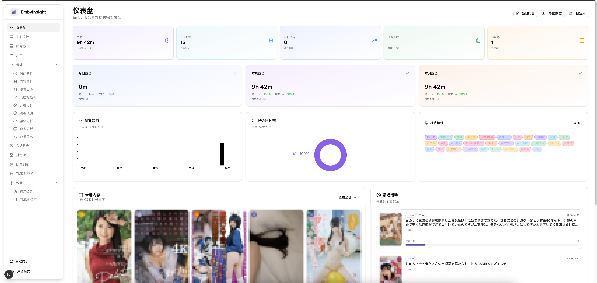

# Emby Insight - Emby 深度数据洞察


[](https://hub.docker.com/r/qiuhusama/emby-insight)



**Emby Insight** 是一个专为 Emby 媒体服务器设计的现代化数据分析与监控面板。它通过直观的图表和详细的统计数据，帮助管理员全面了解服务器的使用情况、用户行为和媒体库状态。

> 项目初衷：Emby 原生仪表盘功能较为基础，难以满足对用户活跃度、观看偏好、设备分布等深层次数据的挖掘需求。

## ✨ 核心功能

### 1. 📊 全能仪表盘 (Dashboard)
- **实时概览**：即时显示总播放时长、影片数量（去重）、今日新增播放、活跃天数等关键指标。
- **趋势分析**：提供过去 30 天的每日观看时长趋势图，支持周环比分析。
- **服务器分布**：多服务器环境下，直观饼图展示各服务器的负载与贡献。
- **最近活动**：实时滚动的用户播放记录流，包含封面、进度条和详细元数据。

### 2. 👥 高级用户管理
- **服务器用户同步**：自动同步所有 Emby 服务器上的用户列表。
- **全局用户 (Global Users)**：独创的“全局身份”概念，支持将不同服务器上的同一自然人账号合并为一个全局用户，实现跨服数据聚合。
- **账号关联与解绑**：灵活的界面操作，支持创建新全局账号或关联现有账号，亦可随时解绑或删除。

### 3. 📈 用户深度画像
- **个人统计页**：每个用户拥有独立的数据详情页。
- **观看习惯**：热力图展示观看高峰时段（24小时分布），偏好标签云 (Genres) 分析。
- **内容偏好**：按电影/剧集分类的饼图分布，以及最常观看的 Top 10 榜单。
- **设备分析**：统计用户使用的客户端类型、设备名称及 IP 地址记录。
- **播放历史**：带海报封面的详细观看记录列表，支持失败回退显示。

### 4. 📺 会话与实时监控
- **活跃会话**：实时查看当前正在播放的内容，包含转码详情、比特率、进度等。
- **历史记录**：完整的历史会话日志，记录真实的观看时长（Real Time）和播放进度。

### 5. 🏆 排行榜 (Leaderboard)
- **用户榜单**：甚至可以按“卷王”程度（观看时长）排名的用户榜单。
- **媒体榜单**：最受欢迎的电影和剧集排名。

## 🛠️ 技术栈

- **框架**: [Next.js 14](https://nextjs.org/) (App Router)
- **语言**: TypeScript
- **数据库/ORM**: SQLite / [Prisma](https://www.prisma.io/)
- **UI 组件库**: [Shadcn UI](https://ui.shadcn.com/) + Tailwind CSS
- **图表库**: [Recharts](https://recharts.org/)
- **图标**: [Lucide React](https://lucide.dev/)
- **状态管理**: TanStack (React) Query

## 🚀 快速开始

### 前置要求
- Node.js 18+
- Emby Server (需要管理员 API Key)

### 安装步骤

1. **克隆项目**
   ```bash
   git clone https://github.com/your-username/emby-insight.git
   cd emby-insight
   ```

2. **安装依赖**
   ```bash
   npm install
   # 或者
   yarn install
   # 或者
   pnpm install
   ```

3. **配置环境变量**
   复制 `.env.example` 为 `.env` 并填入必要信息：
   ```env
   # 数据库文件路径 (默认使用 SQLite)
   DATABASE_URL="file:./dev.db"

   # 这里可以添加其他必要的环境变量配置
   ```
   *注意：项目目前主要通过 API 与 Emby 交互，部分配置可能需要在运行时或配置文件中指定。*

4. **初始化数据库**
   ```bash
   npx prisma generate
   npx prisma db push
   ```

5. **运行开发服务器**
   ```bash
   npm run dev
   ```

6. **访问面板**
   打开浏览器访问 [http://localhost:3000](http://localhost:3000)。

## 🐳 Docker 部署

您可以直接使用我们发布的 Docker 镜像，无需手动构建。

1. **创建 `docker-compose.yml`**

   ```yaml
   version: '3'

   services:
     emby-insight:
       image: qiuhusama/emby-insight:latest
       container_name: emby-insight
       restart: always
       ports:
         - "3000:3000"
       volumes:
         - ./data:/app/data
       environment:
         - DATABASE_URL=file:/app/data/dev.db
   ```

2. **启动服务**
   ```bash
   docker-compose up -d
   ```

2. **数据持久化**
   Docker Compose 配置已将数据库映射到当前目录下的 `./data` 文件夹。这意味着即使重启或重建容器，您的数据（播放历史、用户关联等）也会被保留。

   > **注意**：容器启动时会自动运行 `prisma db push` 以确保数据库结构是最新的。

3. **访问**
   服务启动后，访问 `http://localhost:3000` 即可。


## �📝 使用指南

1. **首次同步**：进入用户管理页面，系统会自动尝试连接已配置的 Emby 服务器并同步用户数据。
2. **关联用户**：在“服务器用户”列表中，勾选属于同一个人的账号，点击“关联用户”将其合并为一个全局账号。
3. **查看报表**：点击仪表盘或用户详情页，即可查看生成的可视化报表。

## 🤝 贡献

欢迎提交 Issue 或 Pull Request！如果你有任何新功能建议，请随时告知。

## 📄 开源协议

本项目采用 [MIT](LICENSE) 协议开源。
